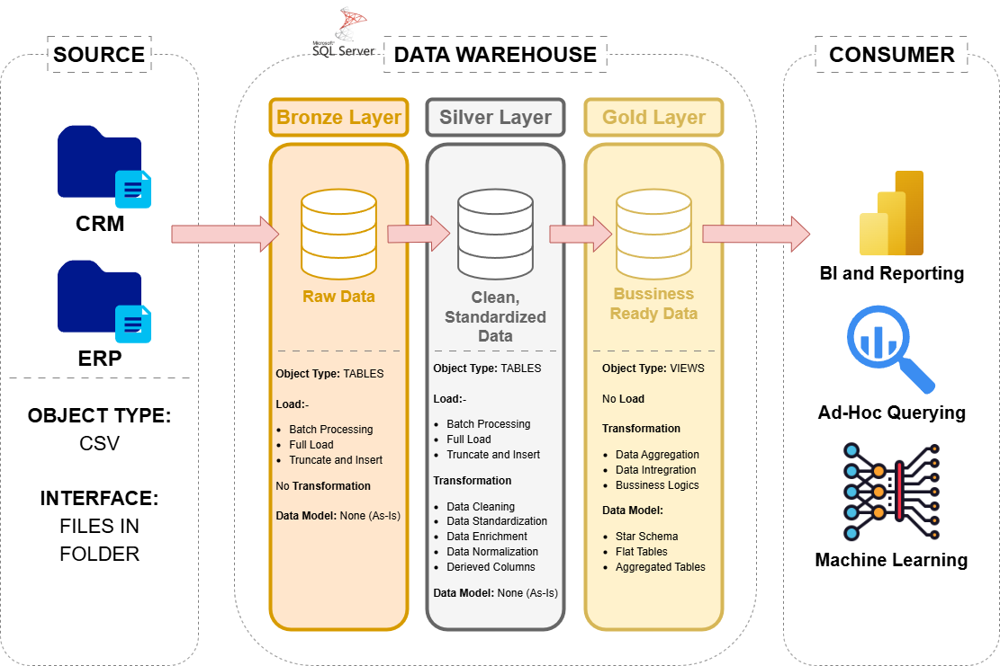

# 📦 SQL Data Warehouse Project

Welcome to **SQL Data Warehouse Project** repository! 📂
This project demonstrates a **Data Warehousing and Analytics** solution built using **SQL Server**.
Used to create a data warehousing solution to perform **ETL Processes** on Data using **Medallion Architecture** to process and store data in layers and generate meaningful insights. 
Build as a portfolio project to showcase industry best practices in data engineering and analytics.

---

## 📌 Project Requirements

### 🏗️ Building Data Warehouse
#### 🎯 Objective
Develop a Modern Data Warehouse in SQL Server using industry best practices to integrate sales data and enabling analytical reporting and decision making. 
#### 📐 Specifications
- **Data Sources**: Import data from ERP and CRM systems provided as CSV files.
- **Data Quality**: Clean, Standardize, Normalize, and Enrich data.
- **Data Integration**: Combine data from different sources.
- **Scope**: Concentrate on the latest dataset. No need for historization of data.
- **Documentation**: create a clear documentation for the analytics team and business stakeholders

### 📊 BI: Analytics and Reporting
#### 🎯 Objective
Develop SQL-based analytics to deliver detailed insights into:
-**Customer Behavior**
-**Product Performance**
-**Sales Trends**
These insights empower stakeholders with key business metrics, enabling strategic decision-making.

---
## 🏗️ Data Architecture

The data architecture for this project follows Medallion Architecture **Bronze**, **Silver**, and **Gold** layers:

1. **Bronze Layer**: Stores raw data as-is from the source systems. Data is ingested from CSV Files into SQL Server Database.
2. **Silver Layer**: This layer includes data cleansing, standardization, and normalization processes to prepare data for analysis.
3. **Gold Layer**: Houses business-ready data modeled into a star schema required for reporting and analytics.

---
## 📖 Project Overview

This project involves:

1. **Data Architecture**: Designing a Modern Data Warehouse Using Medallion Architecture **Bronze**, **Silver**, and **Gold** layers.
2. **ETL Pipelines**: Extracting, transforming, and loading data from source systems into the warehouse.
3. **Data Modeling**: Developing fact and dimension tables optimized for analytical queries.
4. **Analytics & Reporting**: Creating SQL-based reports and dashboards for actionable insights.

🎯 This repository is an excellent resource for professionals and students looking to showcase expertise in:
- SQL Development
- Data Architect
- Data Engineering  
- ETL Pipeline Developer  
- Data Modeling  
- Data Analytics
---

## 📄 License
This project is licensed under the MIT License. You are free to use, modify, and share this project with proper attribution.

---
## 👨‍💻 About Me
Hi! I'm **Sanidhya Madhav Shukla**, a passionate Data Analyst, someone who loves working with data and making it easier for others to understand insights given by data.
Feel free to connect with me on:
[LinkedIn][Gmail][Website]
